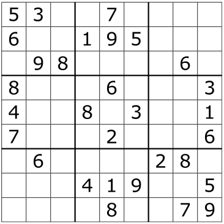
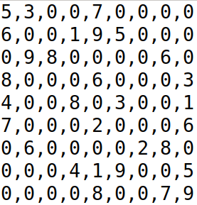
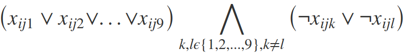

<h1>SUDOKU-SOLVER in C</h1>

<h3>1- Introduction</h3>

This projects is about solving sudoky puzzles with two different approaches. The first one consists in iterating through
a space of possible solutions until finding one that is valid, while the second one uses propositional logic to define a set
of constraints that a SMT-solver will use to find a satisfiable solution.

<h3>2- Background</h3>
Sudoku is a logic game which objective is to fill a 9×9 (there ara other size for the game, but we only focus on 9×9 grids) cell grid with digits in such a way that each column, each row, and each of square of 3×3 cells contain all of the digits 1, 2, ... 9. The following image present an example of incomplete sudoku puzzle from Wikipedia: 
<figure>
  
  <figcaption>Fig1. Example of Sudoku Puzzle</figcaption>
</figure>  

In order to provide a sudoku puzzle to our solver, we adopt the following representation:
<ul> 
  <li> Digits contained in the cells are separated by commas</li> 
  <li> Digit 0 represents empty cells</li> 
</ul>	
In both solving approaches (backtracking and SMT solver), we start by making sure that the initial configuration is correct (we don't have a digit appearing more than once on any row, column, and square. The adopted representation allows storing puzzles to solve into text file that are provided to the solvers. The following image depicts how the previous sudoku is represented in a text-file convenient way:

<figure>
  
  <figcaption>Fig2. Example of Puzzle formatted in a text file </figcaption>
</figure>

<h3>3- Backtracking Approach</h3>
<h4> 3.1 Description</h4>
The source codes can be found in the folder /backtracking. The program solves the sudoku problem recursively. It starts by loading the initial puzzle from a text file passed
as parameter and verifies that the configuration is correct. Next, the program successively attemps to fill empty cells
with values between 1 and 9 in order to keep the puzzle valid. If inserting a digit (between 1 and 9) creates an invalid
puzzle, the programs backtracks up to the faulty assignment and assign the next value (current digit + 1). If we cannot
find a digit assignment that keeps the puzzle valid, then we conclude that the puzzle does not have a valid solution.

<h4>3.2 Compilation Command (using GCC: I tested on Windows 10 and Ubuntu 18.04)</h4> 
gcc -o output_executable -Wall main.c backtracking.c

<h4>3.3 Execution Command (from the command line interface)</h4> 
./output_executable ./../hard_sudoku.txt

<h3>4- Using Satisfiability Modulo Theories (SMT)</h3>
<h4> Description</h4>
The source codes can be found in the folder /SMT-Solver. The program solves the sudoku problem with Z3 (https://github.com/Z3Prover/z3) using propositional logic. <b>We use the C API of Z3</b>.The first step consists in downloading and building Z3 (the steps are described here: https://github.com/Z3Prover/z3). The overall utilization flow of SMT solvers consists in defining a set of rules or contraints that a solution must meet. The solver will then uses a set of algorithm to find a satisfiable assignment of values to the different variables of the problem. If it finds a such assignment, the solver returns "satisfiable" and displays the satisfying assignment. If it can't find a satisfying assignment of variable, it returns "unsatisfiable" to say that all the constraints stated lead to a contradiction: it is not possible to have a solution with such constraints. Otherwise, the solver might return "I don't know" to say that it is not capable of saying with certainty if there is a possible solution or no. In the context of our sudoku problem, we declare a set of boolean variables and 5 constraints.

Boolean variables are labelled xijk, such that xijk is true if cell(i,j) contains the digit k on the sudoku puzzle. We therefore have 9*9*9=729 variables. Our 5 constraints are:

  (1)- In the initial setup, as loaded from the text file, if a digit k is already in cell(i,j), then a requirement passed to the solver is that:
         xijk = true.

       Using the C API of Z3, it will be something like:
           Z3_ast true_node = Z3_mk_true (ctx);
           Z3_mk_eq (ctx, variables[i][j][k], true_node);
           constraints[constraint_counter] = Z3_mk_eq (ctx, variables[i][j][k], true_node);
           constraint_counter ++;

  (2)- Each cell must be assigned one and only one value:
  Lij=(and(or(xij1,xij2,...xij9),or( not(xijk),not(ijl) ) ) ) with i,j,k,l in {1,2,...,9} and k!=l     

      - or(xij1,xij2,...xij9): ensures that each cell(i,j) will at least receive a digit {1,2,...9}
      - or( not(xijk),not(ijl)) ensures that no other digit can be place in the cell

  <figure>
        
        <figcaption>Fig3. Condition Ensuring that each cell will be filled and only contain one digit</figcaption>
     </figure>  

  (3)- Each digit must appear exactly once in each row  
  Lik=(and(or(xi1k,xi2k,...xi9k),or( not(xijk),not(ilk) ) ) ) with i,j,k,l in {1,2,...,9} and j!=l
      - or(xi1k,xi2k,...xi9k): ensures that each digit {1,2,...9} appear in every row i.
      - or( not(xijk),not(ilk)): ensures that a digit appears only once.
    
      <figure>
        
        <figcaption>Fig3. Condition Ensuring that each digit 'k' appears exactly once per row</figcaption>
     </figure>  
  

  (4)- Each digit must appear exactly once in each column 
  Ljk=(and(or(x1jk,x2jk,...x9jk),or( not(xijk),not(ljk) ) ) ) with i,j,k,l in {1,2,...,9} and i!=l
      - or(x1jk,x2jk,...x9jk): ensures that each digit {1,2,...9} appear in every column j.
      - or( not(xijk),not(ljk))): ensures that a digit appears only once.

  (5)- Each digit must appear in each 3x3 square (consequently, the same digit cannot appear more than one time because there is 9 digits for 9 cells)  
      Lijk= (and(or(xij1,xij2,...,xij9))) where i=3U+I: U={0..2}, I={1,..,3};j=3V+J: V={0..2}, J={1,..,3}. This is just a way to go square by square

 If we cannot find a digit assignment that keeps the puzzle valid, then we conclude that the puzzle does not have a valid solution.

<h4>4.1 Compilation Command (using GCC: I tested on Ubuntu 18.04)</h4> 
gcc -o output_executable -Wall main.c utilities.c libz3.so -lpthread -w

I also provided a "compile.sh" file that just need to be executed in a Linux environment (Allocate execution rights: chmod +x compile.sh)
UTILIZATION:
    ./compile.sh output_executable main.c
  example:     
    ./compile.sh output main.c

<h4>4.2 Execution Command (from the command line interface)</h4> 
/output_executable ./../hard_sudoku.txt

<u>Note:</u>
The program create a text log file on the project folder, so please make sure to grant project's folder modification rights to the executable of the program.

I provided 4 examples of sudoku puzzle in the home folder

1- sudoku1.txt 
2- sudoku2.txt 
3- halfHard_sudoku.txt 
4- hard_sudoku.txt 

<h3>5- Contact Information</h3>
<b>Author:</b> Joel Mandebi  
Ph.D. Student in Computer Engineering - University of Florida  
<b>Date:</b> Sept 22, 2019
